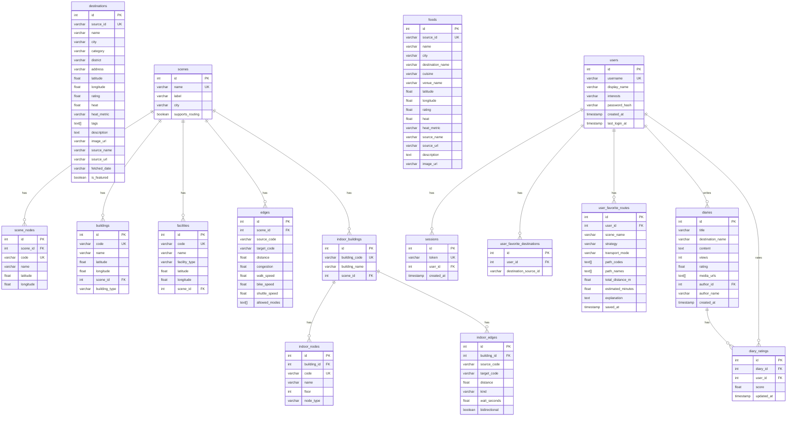
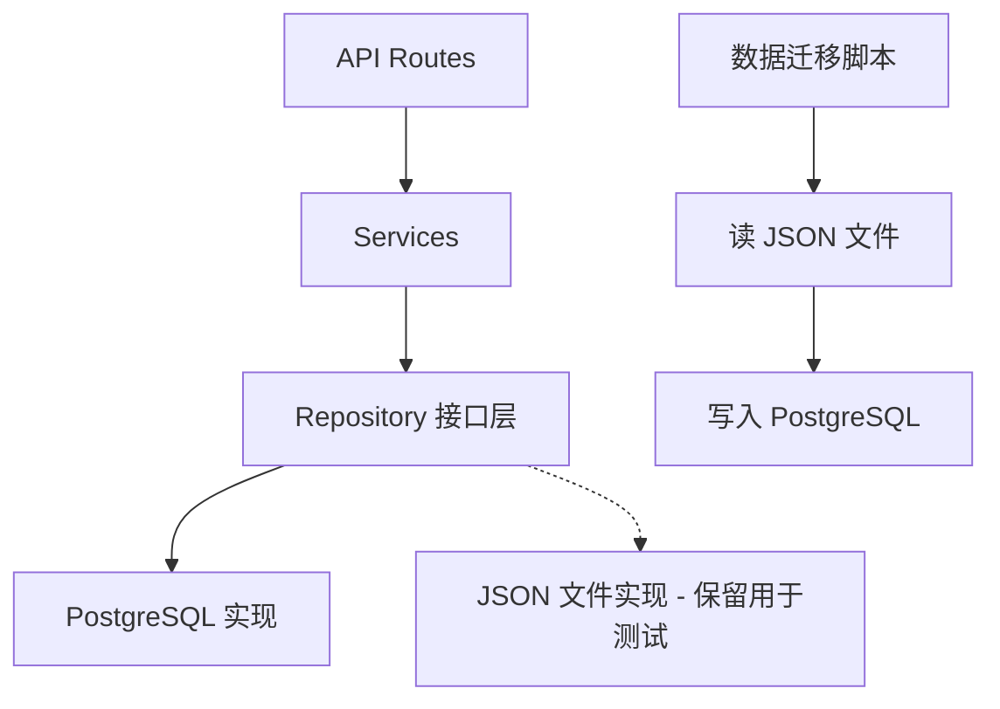

# 项目综合修复与 PostgreSQL 迁移计划

## 一、背景

项目当前使用 JSON 文件（`datasets/prod/*.json`）作为数据存储层，通过 `DatasetRepository` 提供 mtime 级别缓存的读写。现需要将全部数据迁移到 PostgreSQL，JSON 文件仅用于初始数据导入（seed）。

项目已有部分预备工作：
- `infra/postgres/docker-compose.yml` — PostGIS 16 容器定义
- `backend/app/db/base.py` — SQLAlchemy `DeclarativeBase`
- `backend/app/db/session.py` — 引擎和 SessionLocal 工厂
- `backend/app/models/*.py` — 部分 ORM 模型（需要补充和修正）
- `backend/requirements.txt` — 已包含 `sqlalchemy` 和 `psycopg`

## 二、数据实体梳理（JSON → PostgreSQL 表）

根据 JSON 文件的实际数据结构，完整的实体列表如下：

### 核心实体

| JSON 文件 | 目标表名 | 记录数 | 关键字段 | 说明 |
|-----------|---------|--------|----------|------|
| `destinations.json` | `destinations` | 3701 | source_id, name, category, district, latitude, longitude, rating, heat, tags, description, city, image_url, source_name, source_url, fetched_date, heat_metric | tags 是数组 → 用 ARRAY 类型 |
| `featured_destinations.json` | `featured_destinations` | 16 | 同 destinations + rating_source_name 等 | 可考虑用 `is_featured` 标记合并到 destinations 表 |
| `scenes.json` | `scenes` + `scene_nodes` | 5 场景 | name, label, city, supports_routing; nodes 内嵌 code/name/lat/lon | 需要拆分 nodes 为独立表 |
| `buildings.json` | `buildings` | 40 | code, name, latitude, longitude, scene_name, building_type | |
| `facilities.json` | `facilities` | 52 | scene_name, code, name, facility_type, latitude, longitude | |
| `edges.json` | `edges` | 548 | scene_name, source_code, target_code, distance, congestion, walk_speed, bike_speed, shuttle_speed, allowed_modes | allowed_modes 是数组 → ARRAY |
| `foods.json` | `foods` | 8 | name, city, destination_name, cuisine, venue_name, latitude, longitude, rating, heat, source_name, source_url, description, image_url | |
| `indoors.json` | `indoor_buildings` + `indoor_nodes` + `indoor_edges` | 2 建筑 | 嵌套结构，需要拆分 | |

### 用户相关实体（有写操作）

| JSON 文件 | 目标表名 | 记录数 | 关键字段 | 说明 |
|-----------|---------|--------|----------|------|
| `users.json` | `users` | 10+ | id, username, display_name, interests, password_hash, created_at, last_login_at, favorite_destination_ids, favorite_route_snapshots | 收藏需要拆分关联表 |
| `sessions.json` | `sessions` | 动态 | token, user_id, created_at | |
| `diaries.json` | `diaries` | 12+ | id, title, destination_name, content, views, rating, media_urls, author_id, author_name, created_at | media_urls 用 ARRAY |
| `diary_ratings.json` | `diary_ratings` | 动态 | id, diary_id, user_id, score, updated_at | |

### 元数据（可选迁移）

| JSON 文件 | 说明 |
|-----------|------|
| `data_sources.json` | 数据来源说明，可保留为 JSON 不入库 |
| `summary.json` | 统计摘要，可由数据库查询生成 |

## 三、数据库 Schema 设计

## 四、架构变更方案

### 改造层次

### 关键变更

1. **`DatasetRepository` 重构为抽象接口** — 定义所有读写方法的协议
2. **新增 `PostgresRepository`** — 基于 SQLAlchemy Session 实现所有方法
3. **保留 `JsonRepository`（原 DatasetRepository 改名）** — 用于测试和无数据库环境
4. **`deps.py` 通过配置选择 Repository 实现** — 默认使用 PostgreSQL
5. **ORM 模型完善** — 补充缺失的表和关联关系，与 JSON 结构对齐
6. **数据迁移脚本** — `backend/scripts/seed_db.py`，从 JSON 导入到 PostgreSQL
7. **Alembic 数据库迁移** — 管理 schema 版本

## 五、综合修复计划（含代码问题修复 + PostgreSQL 迁移）

### Phase 1: 代码质量修复（不涉及架构变更）

每步一个 git commit：

1. **统一异常处理** — 业务层使用自定义异常替换 `ValueError`，移除路由层 `try/except` 样板
2. **修复测试重复 fixture** — 移除 `test_api.py` 中重复的 `isolate_api_dataset` + 模块级 client
3. **完善 `.gitignore`** — 添加 `__pycache__/`、`.ruff_cache/` 等通配规则
4. **补充前端路由** — 添加 AgentPage 和 AdminPage
5. **更新 AGENTS.md** — 修正日志描述

### Phase 2: PostgreSQL 迁移

6. **完善 ORM 模型** — 按 Schema 设计补充所有表，处理 JSON 嵌套结构的拆分
   - 涉及文件：`backend/app/models/destination.py`, `backend/app/models/user.py`, `backend/app/models/diary.py`
   - 新建文件：`backend/app/models/scene.py`, `backend/app/models/food.py`, `backend/app/models/indoor.py`

7. **引入 Alembic** — 初始化迁移工具，生成初始 migration
   - `alembic init backend/alembic`
   - 生成 `001_initial_schema.py` migration

8. **重构 Repository 层** — 抽象接口 + 两个实现
   - 新建 `backend/app/repositories/base.py` — 抽象基类
   - 重命名 `data_loader.py` → `json_repository.py`
   - 新建 `backend/app/repositories/postgres_repository.py`

9. **更新 `deps.py` 和 `config.py`** — 支持通过环境变量选择存储后端
   - `TRAVEL_STORAGE_BACKEND=postgres|json`

10. **编写数据迁移脚本** — `backend/scripts/seed_db.py`
    - 读取所有 JSON 文件
    - 处理数据转换（嵌套结构拆分、类型映射）
    - 写入 PostgreSQL

11. **更新 `docker-compose.yml`** — 确保密码不硬编码，添加 healthcheck

12. **适配 Service 层** — 确保所有 Service 与新 Repository 接口兼容
    - `GraphBuilder` 需要适配新的数据格式（scene_nodes 拆分后）
    - `IndoorNavigationService` 需要适配 indoor_nodes/indoor_edges 拆分

13. **更新测试** — 测试兼容两种 Repository
    - 单元测试继续用 JSON Repository（无需数据库）
    - 新增集成测试用 PostgreSQL（可选，需要 Docker）

14. **更新 CI** — `requirements.txt` 确认依赖，CI 流程保持使用 JSON 模式测试

### Phase 3: 验证与文档

15. **端到端验证** — 运行全部测试套件
16. **更新文档** — 更新 AGENTS.md、architecture.md

## 六、文件变更清单

### 新建文件
- `backend/app/repositories/base.py` — Repository 抽象接口
- `backend/app/repositories/postgres_repository.py` — PostgreSQL 实现
- `backend/app/models/scene.py` — Scene/SceneNode ORM
- `backend/app/models/food.py` — Food ORM
- `backend/app/models/indoor.py` — IndoorBuilding/IndoorNode/IndoorEdge ORM
- `backend/scripts/seed_db.py` — 数据迁移脚本
- `backend/alembic.ini` — Alembic 配置
- `backend/alembic/` — 迁移目录

### 修改文件
- `backend/app/core/config.py` — 添加 `storage_backend` 配置
- `backend/app/core/exceptions.py` — 保留不变
- `backend/app/repositories/data_loader.py` → 重命名为 `json_repository.py`
- `backend/app/api/deps.py` — 按配置选择 Repository
- `backend/app/db/session.py` — 懒加载改造
- `backend/app/models/destination.py` — 对齐 JSON 数据结构
- `backend/app/models/user.py` — 添加关联表
- `backend/app/models/diary.py` — 添加 media_urls ARRAY
- `backend/app/models/__init__.py` — 更新导出
- `backend/app/services/auth_service.py` — 异常类型修复
- `backend/app/services/routing_service.py` — 异常类型修复
- `backend/app/services/indoor_service.py` — 异常类型修复
- `backend/app/services/graph_builder.py` — 适配新数据格式
- `backend/app/api/routes/auth.py` — 移除 try/except 样板
- `backend/tests/conftest.py` — 可能需要更新
- `backend/tests/test_api.py` — 移除重复 fixture
- `backend/requirements.txt` — 添加 alembic
- `.gitignore` — 完善规则
- `frontend/src/router/index.ts` — 添加路由
- `AGENTS.md` — 更新架构描述
- `infra/postgres/docker-compose.yml` — 添加 healthcheck
