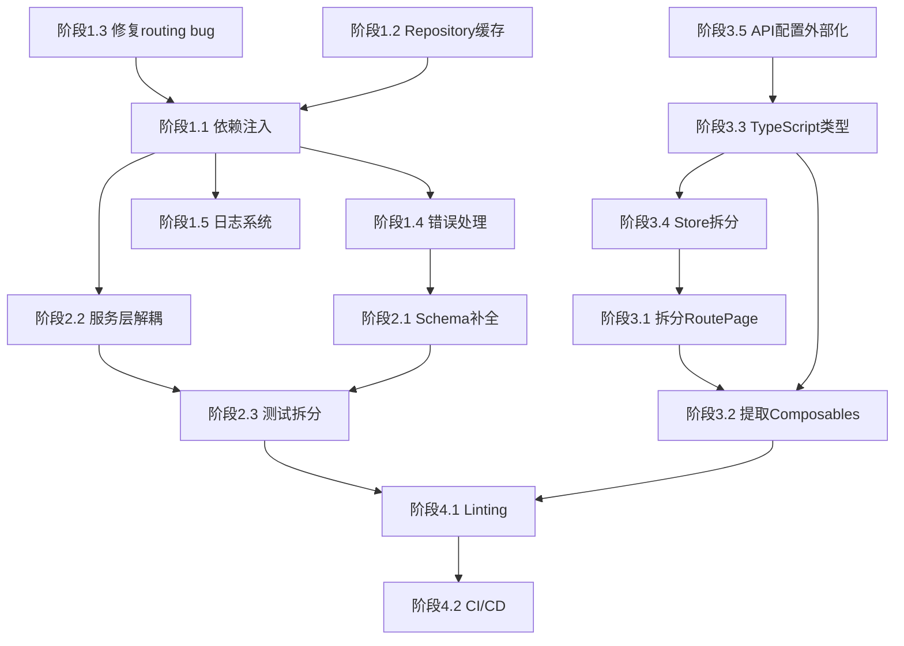

# 重构计划：北京高校与景区个性化旅游系统

## 一、现状诊断

### 1.1 项目概览

- **前端**：Vue 3 + TypeScript + Vite + Pinia + Vue Router + Leaflet
- **后端**：FastAPI + SQLAlchemy + Pydantic
- **数据**：JSON 文件快照（datasets/prod/），预留 PostgreSQL
- **算法**：堆 TopK、Quickselect、Trie、倒排索引、Dijkstra、A*、Held-Karp、2-opt、Huffman

### 1.2 核心问题清单

#### 后端问题

| # | 问题 | 位置 | 严重度 |
|---|------|------|--------|
| B1 | **Service 层无依赖注入** —— 每次请求 new 一个 Service 实例，图缓存/索引缓存无法跨请求复用 | `routes/*.py` 全部路由 | 高 |
| B2 | **DatasetRepository 无缓存** —— 每次调用都重新读取 JSON 文件并 json.loads，生产数据集 200+ 条 | `data_loader.py` | 高 |
| B3 | **DiarySearchService 每请求重建** —— 倒排索引每次请求都要检查 `_built` 但因为实例是新的所以永远要重建 | `diary_service.py` + `diaries.py` | 高 |
| B4 | **NearbyFacilityService 直接访问 _scene_graph 私有方法** —— 跨服务耦合 | `facility_service.py:17` | 中 |
| B5 | **plan_single 有逻辑 bug** —— `if resolved_start_code == end_code` 之后没有 `return` / `else`，导致 `path_codes` 可能未定义就被后续引用 | `routing_service.py:234-240` | 高 |
| B6 | **AuthService 每次请求全量读写用户 JSON** —— 无任何缓存或事务保护 | `auth_service.py` | 中 |
| B7 | **schemas 定义不完整** —— 大量 route handler 直接返回 `dict` 而非 Pydantic model | 多个 routes | 中 |
| B8 | **缺少全局错误处理** —— ValueError 等异常直接抛出，无统一 exception handler | `main.py` | 中 |
| B9 | **缺少日志系统** —— 整个后端无 logging 配置 | 全局 | 中 |
| B10 | **测试文件组织混乱** —— 只有两个大测试文件，没有按模块拆分 | `tests/` | 低 |

#### 前端问题

| # | 问题 | 位置 | 严重度 |
|---|------|------|--------|
| F1 | **RoutePage.vue 581行巨型组件** —— 混合了室外导航、室内导航、定位、收藏等所有逻辑 | `RoutePage.vue` | 高 |
| F2 | **大量 any 类型** —— stores 和 pages 中充斥 `any` 类型，TypeScript 形同虚设 | `travel.ts`, `auth.ts`, 各 pages | 高 |
| F3 | **API baseURL 硬编码** —— `http://127.0.0.1:8000/api` 写死在代码中 | `client.ts:6` | 中 |
| F4 | **缺少 API 层类型定义** —— 前后端数据契约完全靠 any | `api/client.ts` | 中 |
| F5 | **Store 设计 —— travel.ts 是个大杂烩** —— destinations/foods/diaries 全部塞在一个 store | `travel.ts` | 中 |
| F6 | **缺少 composables 抽象** —— RoutePage 中大量可复用逻辑（定位、场景加载）没有抽取 | 各 pages | 中 |
| F7 | **路由定义缺少 name 和 lazy loading** | `router/index.ts` | 低 |
| F8 | **CSS 全部在一个 main.css** —— 没有组件级样式隔离 | `styles/main.css` | 低 |

#### 架构问题

| # | 问题 | 严重度 |
|---|------|--------|
| A1 | **无依赖注入容器** —— 后端服务之间手动 new，无法替换/测试/缓存 | 高 |
| A2 | **数据层与业务层耦合** —— 服务直接操作 repository 返回的 dict，无领域模型 | 中 |
| A3 | **前后端类型不同步** —— 没有共享的 API 契约 | 中 |

---

## 二、重构方案

### 阶段 1：后端基础设施治理（优先级最高）

#### 1.1 引入依赖注入 + 服务单例缓存

**目标**：解决 B1、B2、B3、B4 — 服务实例跨请求复用

```
backend/app/api/deps.py  →  新增 get_xxx_service() 依赖项
```

- `DatasetRepository` 通过 `lru_cache` 已经是单例（✓ 已有）
- 新增 `get_routing_service()`、`get_search_service()`、`get_diary_service()` 等依赖函数
- 服务实例绑定到 FastAPI `app.state` 或通过 `lru_cache` 实现跨请求复用
- 索引/图缓存在 Service 实例内部只构建一次

#### 1.2 DatasetRepository 增加读缓存

**目标**：解决 B2 — 避免每次请求都 json.loads

- 增加 `_cache: dict[str, tuple[float, list]]` 按文件修改时间缓存
- 只有文件被写入后才失效对应缓存
- 写入操作主动清除对应 key 的缓存

#### 1.3 修复 routing_service 逻辑 bug

**目标**：解决 B5

- `plan_single` 中 `if resolved_start_code == end_code` 分支缺少 `return` 或 `else`
- 重构为 early return 模式

#### 1.4 统一错误处理

**目标**：解决 B8

- 新增 `backend/app/core/exceptions.py`：自定义异常类
- 新增 `backend/app/core/error_handlers.py`：全局 exception handler
- `ValueError` → `BusinessError(status_code=400)`
- `KeyError` / `NotFound` → `NotFoundError(status_code=404)`

#### 1.5 日志系统

**目标**：解决 B9

- 在 `backend/app/core/logging.py` 配置 structlog 或标准 logging
- 关键路径（路线规划、搜索、认证）添加日志

---

### 阶段 2：后端分层规范化

#### 2.1 Schema 补全

**目标**：解决 B7

- 为所有返回 `dict` 的路由补全 Pydantic response_model
- 新增文件：`schemas/facility.py`、`schemas/auth.py`、`schemas/food.py`、`schemas/map.py`

#### 2.2 服务层解耦

**目标**：解决 B4

- `NearbyFacilityService` 不再直接访问 `RoutePlanningService._scene_graph`
- 通过公开方法 `get_scene_graph()` 或独立的 `GraphBuilder` 服务提供图实例
- 抽取 `GraphBuilder` 类负责从 repository 数据构建 Graph 实例

#### 2.3 测试拆分

**目标**：解决 B10

- `test_algorithms.py` → 按算法模块拆分：`test_topk.py`、`test_search.py`、`test_graph.py`、`test_tsp.py`、`test_compression.py`
- `test_api.py` → 按路由模块拆分：`test_api_destinations.py`、`test_api_routes.py`、`test_api_diaries.py` 等
- 新增 `conftest.py` 提取公共 fixture

---

### 阶段 3：前端架构治理

#### 3.1 拆分巨型组件 RoutePage.vue

**目标**：解决 F1

从 581 行拆分为：
- `RoutePage.vue` — 页面容器 + 布局（~80行）
- `components/route/OutdoorRoutePanel.vue` — 室外单点/多点规划
- `components/route/IndoorRoutePanel.vue` — 室内导航
- `components/route/TravelProfileSelector.vue` — 出行风格选择
- `components/route/LocationCapture.vue` — 定位功能
- `components/route/RouteSegmentList.vue` — 分段导航展示
- `components/route/AlternativeRoutes.vue` — 备选路线

#### 3.2 提取 Composables

**目标**：解决 F6

- `composables/useGeolocation.ts` — 定位逻辑
- `composables/useSceneLoader.ts` — 场景加载
- `composables/useRoutePlanner.ts` — 路线规划 API 调用
- `composables/useIndoorNavigation.ts` — 室内导航

#### 3.3 TypeScript 类型治理

**目标**：解决 F2、F4

- 新增 `types/api.ts` — 定义所有 API 响应类型
- 新增 `types/models.ts` — 定义领域模型类型
- 将所有 `any` 替换为具体类型

#### 3.4 Store 拆分

**目标**：解决 F5

- `stores/travel.ts` → 拆为 `stores/destinations.ts`、`stores/foods.ts`、`stores/diaries.ts`
- 每个 store 职责单一

#### 3.5 API 配置外部化

**目标**：解决 F3

- baseURL 改为从 Vite 环境变量 `VITE_API_BASE_URL` 读取
- 新增 `.env` 和 `.env.example`

#### 3.6 路由懒加载 + 命名

**目标**：解决 F7

- 所有路由使用 `() => import(...)` 懒加载
- 添加 route name

---

### 阶段 4：质量保障

#### 4.1 Linting & Formatting

- 后端：添加 `ruff` 配置（`pyproject.toml`）
- 前端：添加 ESLint + Prettier 配置
- 添加 `pre-commit` hook

#### 4.2 CI/CD

- `.github/workflows/ci.yml`：lint + test on push/PR

---

## 三、重构顺序与依赖关系



## 四、文件变更预览

### 新增文件

```
backend/app/core/exceptions.py          # 自定义异常
backend/app/core/error_handlers.py      # 全局错误处理
backend/app/core/logging.py             # 日志配置
backend/app/services/graph_builder.py   # 图构建服务（从 routing_service 抽取）
backend/app/schemas/facility.py         # 设施 schema
backend/app/schemas/auth.py             # 认证 schema
backend/app/schemas/food.py             # 美食 schema
backend/app/schemas/map.py              # 地图 schema
backend/tests/conftest.py               # 公共测试 fixture
backend/tests/test_topk.py
backend/tests/test_search.py
backend/tests/test_graph.py
backend/tests/test_tsp.py
backend/tests/test_compression.py
backend/tests/test_api_destinations.py
backend/tests/test_api_routes.py
backend/tests/test_api_diaries.py
backend/tests/test_api_auth.py
backend/tests/test_api_facilities.py
backend/tests/test_api_indoor.py
frontend/.env                           # 环境变量
frontend/.env.example
frontend/src/types/api.ts               # API 类型定义
frontend/src/types/models.ts            # 领域模型类型
frontend/src/composables/useGeolocation.ts
frontend/src/composables/useSceneLoader.ts
frontend/src/composables/useRoutePlanner.ts
frontend/src/composables/useIndoorNavigation.ts
frontend/src/stores/destinations.ts
frontend/src/stores/foods.ts
frontend/src/stores/diaries.ts
frontend/src/components/route/OutdoorRoutePanel.vue
frontend/src/components/route/IndoorRoutePanel.vue
frontend/src/components/route/TravelProfileSelector.vue
frontend/src/components/route/LocationCapture.vue
frontend/src/components/route/RouteSegmentList.vue
frontend/src/components/route/AlternativeRoutes.vue
```

### 重大修改文件

```
backend/app/api/deps.py                 # 增加服务依赖注入
backend/app/repositories/data_loader.py # 增加读缓存
backend/app/services/routing_service.py # 修复 bug + 抽取 GraphBuilder
backend/app/services/facility_service.py # 解耦
backend/app/main.py                     # 注册错误处理器 + 日志
backend/app/api/routes/*.py             # 使用 DI + response_model
frontend/src/api/client.ts              # baseURL 环境变量化
frontend/src/stores/travel.ts           # 拆分后废弃
frontend/src/pages/RoutePage.vue        # 大幅瘦身
frontend/src/router/index.ts            # 懒加载
```

## 五、风险控制

1. **每个阶段结束后跑全量测试** — `cd backend && pytest`
2. **后端重构先行** — 前端依赖后端 API 契约，后端稳定后再动前端
3. **保持 API 兼容** — 不改变现有 API 的 URL 和返回结构，只补充 schema
4. **Git 分支策略** — 每个阶段一个 feature branch，合并前通过 CI
